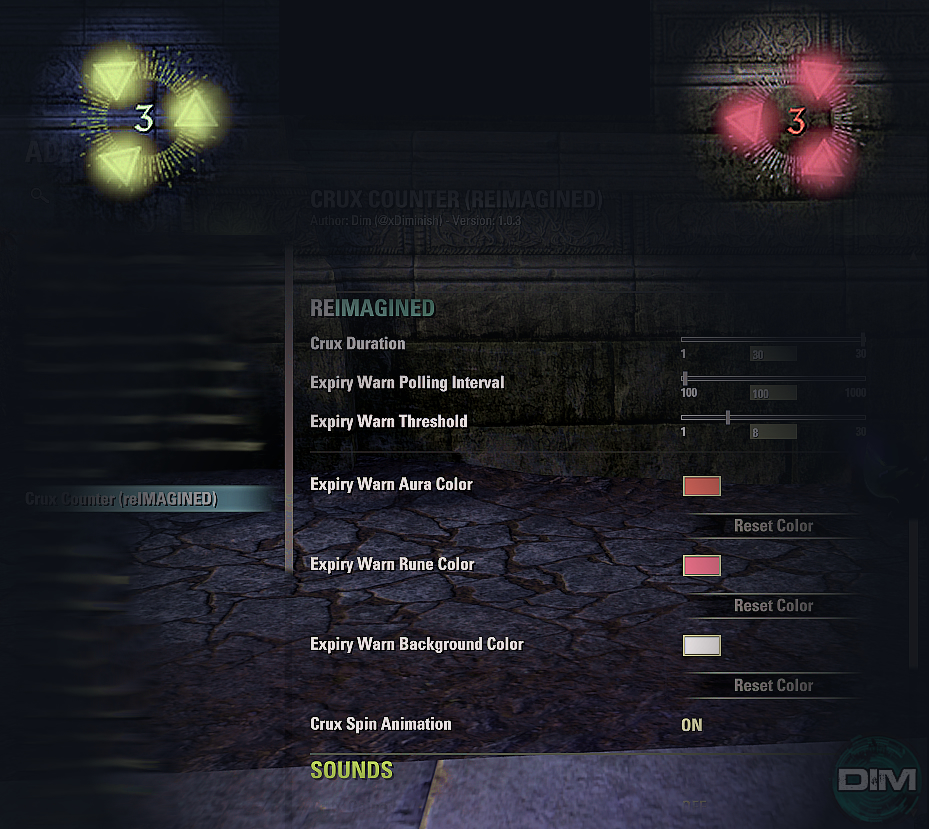

# Crux Counter (reIMAGINED)

An updated build of the original Crux Counter ESO addon by @g4rr3t, redesigned to integrate new features and improved functionality.

 

---

## ✨ New Features

- **Subclassing support**  
  Fully supports the Arcanist class and subclassing. When you add any Arcanist skill lines the add-on will be visible to that character. Upon removing Arcanist subclassed skill lines (even via the armory) the addon will no longer appear for that character. As long as the addon is enabled in your addons menu, it will automatically detect Arcanist skill line changes with zero player input required.

- **Crux expiration warning system**  
  Customize a threshold in seconds at which the Crux buff is considered "about to expire". When that threshold is reached:
  - The crux runes color updates to the Expiry Warn Rune Color specified in the addon settings
  - The background ring color updates to the Expiry Warn Background Color specified in the addon settings
  - The aura (crux count) color updates to the Expiry Warn Aura Color specified in the addon settings
  - Flash in warn threshold animation effects

- **UI and performance improvements**  
  Includes code refactoring, visual polish, and optimzation of the original Crux Counter addon.

---

## 📌 What's New in version 1.0.4 r02

  - Added flash animations for runes, background, and aura numbers using smooth interpolation and sine wave-based timing.
  - Introduced customizable flash speed and color transitions via the addon settings panel.
  - Improved settings panel with new sliders, toggles, and per-element color pickers.
  - Replaced alpha-based visibility logic with more robust SetHidden() handling.
  - Enhanced debug command support (/ccr help, /ccr debug 1–3) for easier diagnostics.
  - Added localization support for all new settings UI strings.

👉 [View full changelog →](CHANGELOG.md)

---

## 📦 Installation

1. Extract into your AddOns directory:  
   `C:\Users\<YourUser>\Documents\Elder Scrolls Online\live\AddOns`
2. Enable the addon in the ESO AddOn menu.
3. If the game is already launched, simply reload the UI with `/reloadui`.

---

## 👤 Author

Created by **Dim** (`@xDiminish`) [PCNA] 

---

## 🔢 Version

**1.0.4 r02**

---

## 🧩 Dependencies

[LibAddonMenu-2.0>=r40](https://www.esoui.com/downloads/info7-LibAddonMenu-2.0.html)

---

## 📜 Disclaimer

This addon is an updated version of [Crux Counter v1.3.0](https://github.com/inimicus/CruxCounter) created by `@g4rr3t`.  
With the exception of original Crux Counter code, the original author is not affiliated with this project.

This AddOn is not created by, affiliated with, or sponsored by ZeniMax Media Inc. or its affiliates.  
The Elder Scrolls® and related logos are registered trademarks or trademarks of ZeniMax Media Inc. in the United States and/or other countries. All rights reserved.  
You can read the full terms at:  
[https://account.elderscrollsonline.com/add-on-terms](https://account.elderscrollsonline.com/add-on-terms)